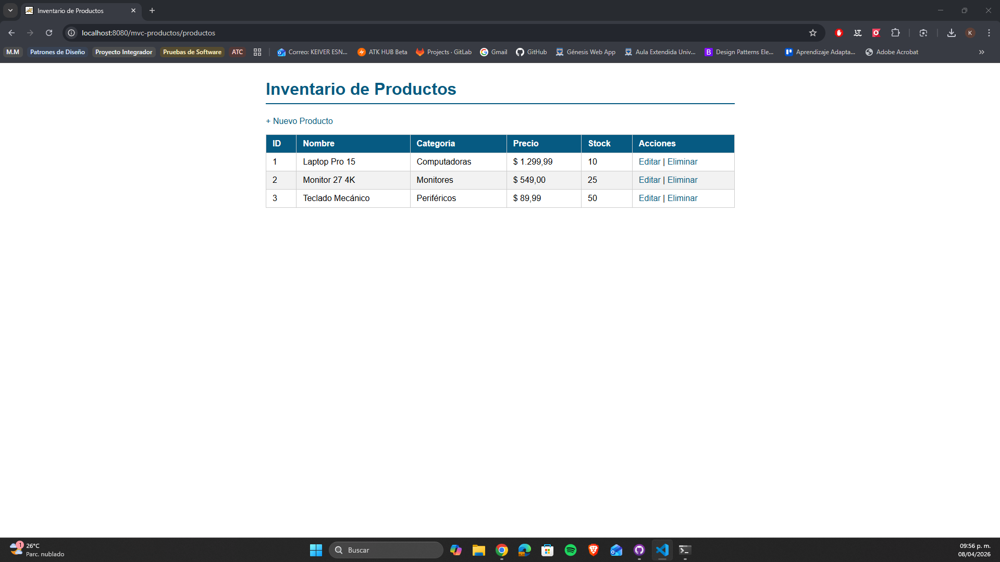
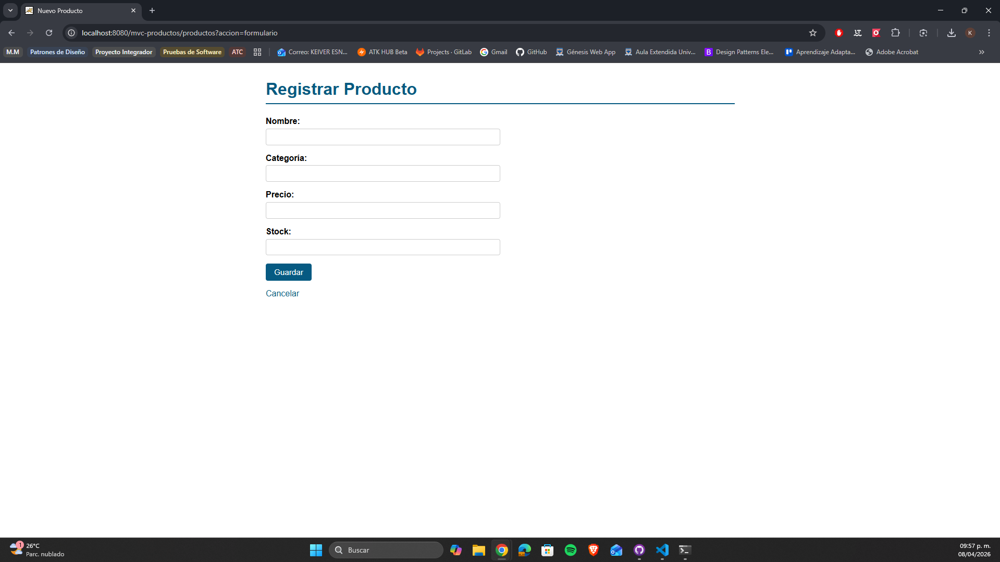
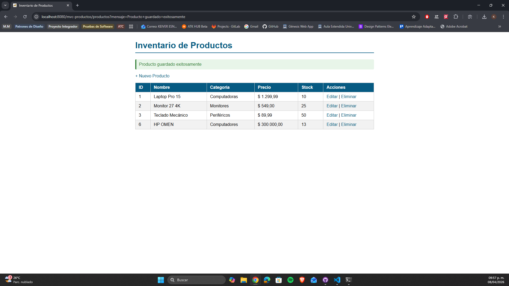
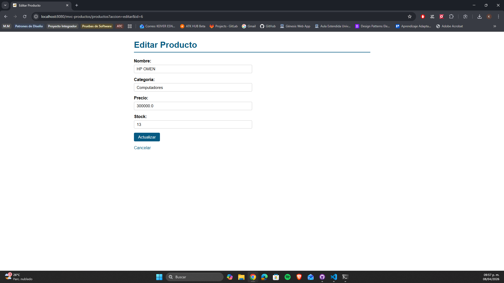
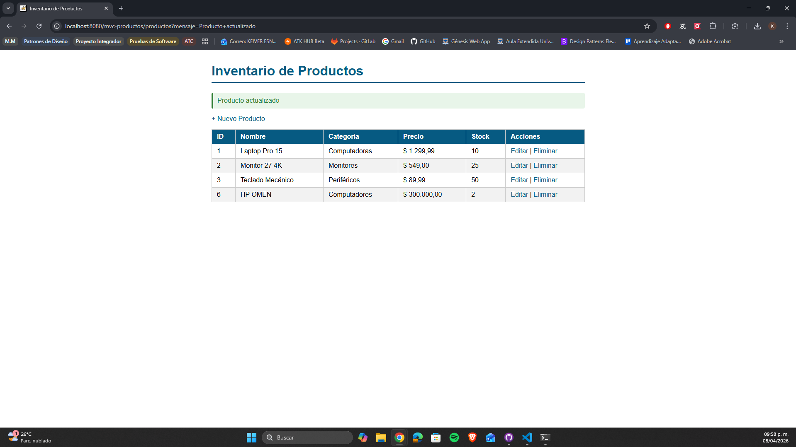
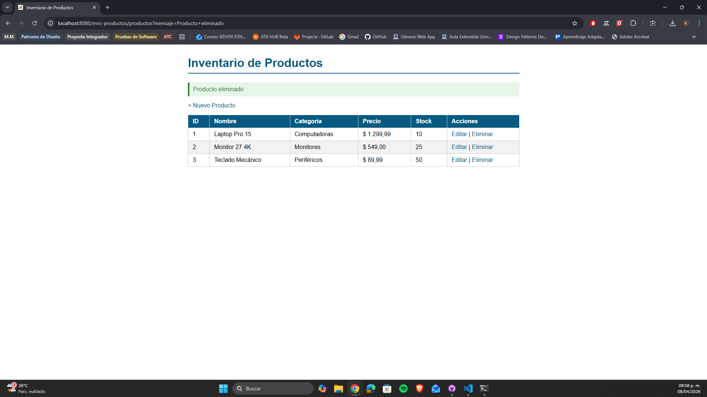

# CRUD de Productos con MVC — Post-Contenido 1 Unidad 6

> **Post-Contenido 1 — Unidad 6**

Aplicación web Java que implementa el patrón de diseño MVC (Modelo-Vista-Controlador) con un CRUD completo de productos. El Servlet actúa como controlador, las vistas JSP usan Expression Language y JSTL, y la lógica de negocio está separada en una capa de servicio con su respectivo DAO en memoria.

## Tecnologías utilizadas

- **Java 21**
- **Jakarta Servlet API 6.0**
- **JSTL 3.0**
- **Apache Tomcat 10.1.52**
- **Maven 3.9.12**

## Estructura del proyecto

```text
src/
└── main/
    ├── java/
    │   └── com/universidad/mvc/
    │       ├── model/
    │       │   ├── Producto.java
    │       │   └── ProductoDAO.java
    │       ├── service/
    │       │   └── ProductoService.java
    │       └── controller/
    │           └── ProductoServlet.java
    └── webapp/
        ├── WEB-INF/
        │   ├── views/
    │   │   ├── lista.jsp
    │   │   ├── formulario.jsp
    │   │   └── error.jsp
    │   └── web.xml
        ├── css/
        │   └── estilos.css
        └── index.jsp
```

## Requisitos previos

- **Java 17** o superior
- **Apache Tomcat 10.x**
- **Maven 3.8+**

## Instrucciones de ejecución

1. **Clonar el repositorio**

```bash
   git clone https://github.com/tu-usuario/castellanos-post1-u6.git
   cd castellanos-post1-u6
```

2. **Compilar el proyecto**

```bash
   mvn clean package
```

3. **Desplegar en Tomcat**

```cmd
   copy target\mvc-productos.war C:\tomcat10\webapps\
```

4. **Iniciar Tomcat**

```cmd
   C:\tomcat10\bin\startup.bat
```

5. **Acceder a la aplicación**

   [http://localhost:8080/mvc-productos/productos](http://localhost:8080/mvc-productos/productos)

## Funcionalidades implementadas

- **Listar productos:** muestra todos los productos en una tabla con filas alternadas
- **Crear producto:** formulario vacío con validación de nombre y precio
- **Editar producto:** formulario precargado con los datos del producto seleccionado
- **Eliminar producto:** confirmación antes de eliminar con diálogo nativo del navegador
- **Mensajes de éxito:** notificación visual tras cada operación CRUD
- **Patrón PRG:** redirige después de cada POST para evitar reenvío de formularios
- **Patrón MVC:** separación clara entre modelo, vista y controlador

## Capturas de pantalla

### Lista de productos



### Formulario de nuevo producto



### Producto guardado exitosamente



### Formulario de edición



### Producto editado



### Producto eliminado


